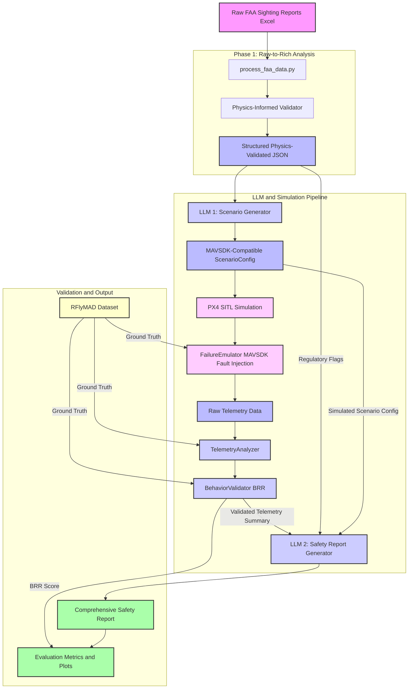
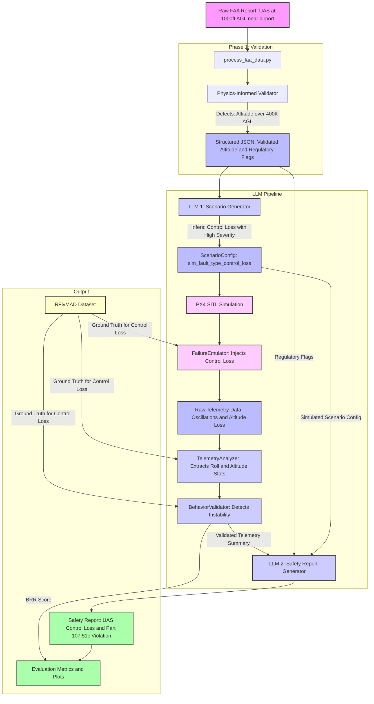

# AeroGuardian Project: Robust Flow Diagrams

## 1. High-Level Project Architecture

```mermaid
graph TD
    %% Input Layer
    A[Raw FAA Sighting Reports Excel] --> B[process_faa_data.py]

    %% Phase 1: Data Analysis & Validation
    subgraph Data_Analysis [Phase 1: Raw-to-Rich Analysis]
        B --> C[Physics-Informed Validator]
        C --> D[Structured Physics-Validated JSON]
    end

    %% LLM Pipeline
    subgraph LLM_Pipeline [LLM and Simulation Pipeline]
        D --> E[LLM 1: Scenario Generator]
        E --> F[MAVSDK-Compatible ScenarioConfig]
        F --> G[PX4 SITL Simulation]
        G --> H[FailureEmulator MAVSDK Fault Injection]
        H --> I[Raw Telemetry Data]
        
        I --> J[TelemetryAnalyzer]
        J --> K[BehaviorValidator BRR]
        K -- Validated Telemetry Summary --> L[LLM 2: Safety Report Generator]
        D -- Regulatory Flags --> L
        F -- Simulated Scenario Config --> L
    end

    %% Validation & Output
    subgraph Output_Layer [Validation and Output]
        K -- BRR Score --> M[Evaluation Metrics and Plots]
        L --> N[Comprehensive Safety Report]
        N --> M
        O[RFlyMAD Dataset] -- Ground Truth --> J
        O -- Ground Truth --> K
        O -- Ground Truth --> H
    end

    %% Styling
    style A fill:#f9f,stroke:#333,stroke-width:2px
    style D fill:#bbf,stroke:#333,stroke-width:2px
    style E fill:#ccf,stroke:#333,stroke-width:2px
    style F fill:#bbf,stroke:#333,stroke-width:2px
    style G fill:#fcf,stroke:#333,stroke-width:2px
    style H fill:#fcf,stroke:#333,stroke-width:2px
    style I fill:#bbf,stroke:#333,stroke-width:2px
    style J fill:#ccf,stroke:#333,stroke-width:2px
    style K fill:#ccf,stroke:#333,stroke-width:2px
    style L fill:#ccf,stroke:#333,stroke-width:2px
    style M fill:#afa,stroke:#333,stroke-width:2px
    style N fill:#afa,stroke:#333,stroke-width:2px
    style O fill:#ffc,stroke:#333,stroke-width:2px
```

## 2. Example Flow: High-Altitude Sighting with Regulatory Violation

```mermaid
graph TD
    %% Input
    A[Raw FAA Report: UAS at 1000ft AGL near airport] --> B[process_faa_data.py]

    %% Phase 1
    subgraph Phase_1 [Phase 1: Validation]
        B --> C[Physics-Informed Validator]
        C -- Detects: Altitude over 400ft AGL --> D[Structured JSON: Validated Altitude and Regulatory Flags]
    end

    %% LLM Pipeline
    subgraph Pipeline [LLM Pipeline]
        D --> E[LLM 1: Scenario Generator]
        E -- Infers: Control Loss with High Severity --> F[ScenarioConfig: sim_fault_type_control_loss] 
        F --> G[PX4 SITL Simulation]
        G --> H[FailureEmulator: Injects Control Loss]
        H --> I[Raw Telemetry Data: Oscillations and Altitude Loss]

        I --> J[TelemetryAnalyzer: Extracts Roll and Altitude Stats]
        J --> K[BehaviorValidator: Detects Instability]
        K -- Validated Telemetry Summary --> L[LLM 2: Safety Report Generator]
        D -- Regulatory Flags --> L
        F -- Simulated Scenario Config --> L
    end

    %% Output
    subgraph Output [Output]
        K -- BRR Score --> M[Evaluation Metrics and Plots]
        L --> N[Safety Report: UAS Control Loss and Part 107.51c Violation]
        N --> M
        O[RFlyMAD Dataset] -- Ground Truth for Control Loss --> J
        O -- Ground Truth for Control Loss --> K
        O -- Ground Truth for Control Loss --> H
    end

    %% Styling
    style A fill:#f9f,stroke:#333,stroke-width:2px
    style D fill:#bbf,stroke:#333,stroke-width:2px
    style E fill:#ccf,stroke:#333,stroke-width:2px
    style F fill:#bbf,stroke:#333,stroke-width:2px
    style G fill:#fcf,stroke:#333,stroke-width:2px
    style H fill:#fcf,stroke:#333,stroke-width:2px
    style I fill:#bbf,stroke:#333,stroke-width:2px
    style J fill:#ccf,stroke:#333,stroke-width:2px
    style K fill:#ccf,stroke:#333,stroke-width:2px
    style L fill:#ccf,stroke:#333,stroke-width:2px
    style M fill:#afa,stroke:#333,stroke-width:2px
    style N fill:#afa,stroke:#333,stroke-width:2px
    style O fill:#ffc,stroke:#333,stroke-width:2px
```
